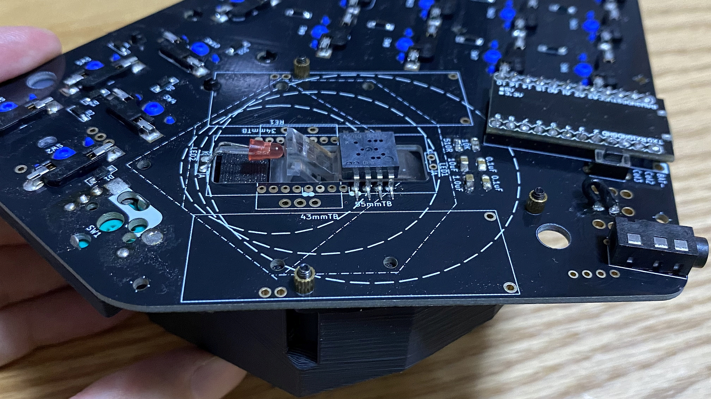
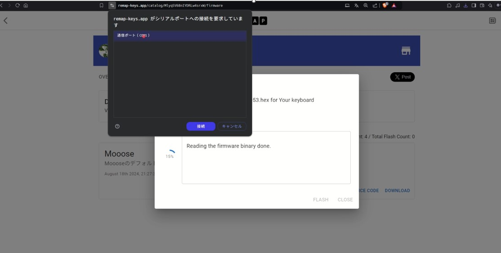
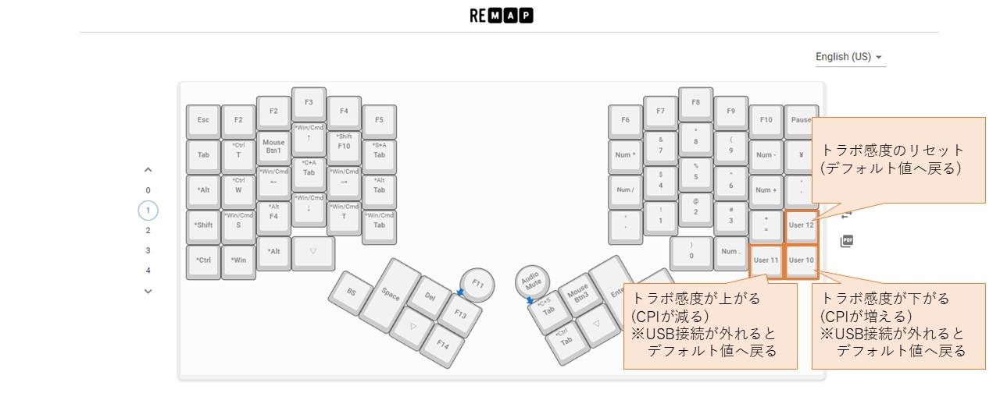
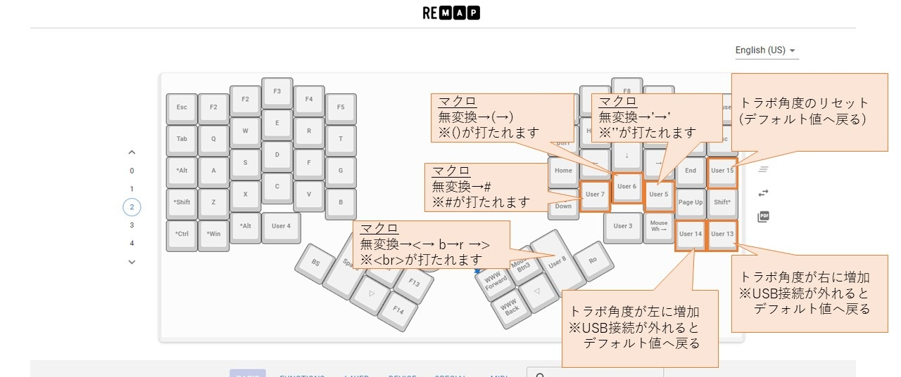
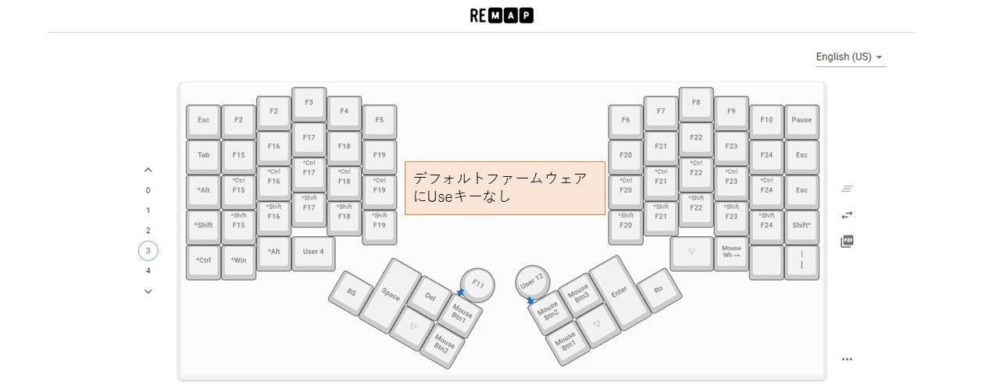
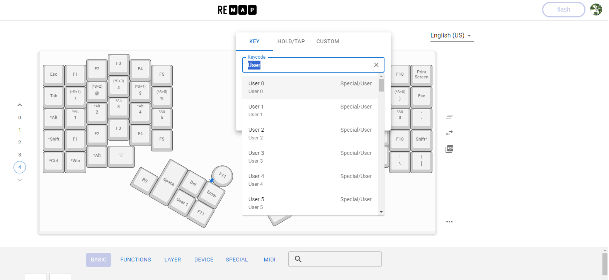

# Moooseのビルドガイド

- [キット内容](#キット内容)
- [ご自身で手配いただくもの](#ご自身で手配いただくもの)
- [はんだ付け](#はんだ付け)
- [組み立て](#組み立て)
- [部品について](#部品について)
- [プログラム書き込み(Remap)](#プログラム書き込みremap)
- [キーマップのカスタマイズ設定](#キーマップのカスタマイズ設定)
- [Userキーについて](#userキーについて)
- [補足](#補足)
- [おわりに](#おわりに)


## キット内容
以下の内容がキットに含まれます。  
### ケース関係
| ケース関係               | 個数        |
| :----------------------- | ----------- |
| ケース上部               | 左右1セット |
| ケース下部               | 左右1セット |
| ミドルプレート           | 左右1セット |
| エンコーダ部分カバー     | 1個         |
| トラボケース下部         | 1個         |
| トラボケース上部         | 1個         |
| ロータリーエンコーダノブ | 1個         |
| トラボケース(レザー)     | 1個         |
| ネジ                     | ＊個        |

追記(25/3/4)：右手側のロータリーエンコーダのノブもキット内容に含めました。  

ある程度組み立てた状態で頒布します。  
ご自身で一度ネジ止めを外してください。  


### 部品関係
| 部品関係                   | 個数        |
| :------------------------- | :---------- |
| 基板                       | 左右1セット |
| 光学センサ                 | ADNS5050    |
| 発光ダイオード             | 1個         |
| 光学センサまわりのもろもろ | もろもろ    |
| 55mmトラックボール         | 1個         |

光学センサまわりははんだ付けして動作確認した状態にします。  
基板設計ミスにつき1部ブリッジしています。  
もし、トラックボールの挙動ががおかしい場合はご連絡ください。  

## ご自身で手配いただくもの
| ご自身で手配いただくもの    | 個数            | 例(参考リンク) |
| :-------------------------- | :-------------- | :-------------- |
| リセットスイッチ(※1)       | 左右それぞれ1個 | https://shop.yushakobo.jp/products/a0800ts-01-1 |
| TRRSコネクタ                | 2個             | https://shop.yushakobo.jp/products/a0800tr-01-1?_pos=2&_sid=b19f48cbe&_ss=r |
| TRRSケーブル                | 1本             | https://shop.yushakobo.jp/products/8023?_pos=3&_sid=b19f48cbe&_ss=r |
| ホットスワップ(MX用)        | 70個            | https://shop.yushakobo.jp/products/a01ps?variant=37665172521121 |
| 表面実装ダイオード(1N4148W) | 70個            | https://shop.yushakobo.jp/products/a0800di-02-100?variant=37665574420641 |
| キースイッチ(MX互換)        | 70個            | ※ロープロファイルは未対応です。 |
| promicro(Type-B)(※2)       | 左右それぞれ1個 | ・https://shop.yushakobo.jp/products/21<br>or<br>・https://shop.yushakobo.jp/products/pro-micro |
| ロータリーエンコーダ<br>(軸形状:Dカット)  | 任意            | https://shop.yushakobo.jp/products/3762?variant=42672275292391 |

※1:タクタイルスイッチ - 2pin 3.5x6x4.3mm  
※2:Type-Cは少し基板が大きいとのこと、現状のケースと干渉するためType-Bをお選びください。  
(すでに印刷したケースの在庫が終わり次第、ケースを改良します。その際はXなどで情報を公開いたします。)  
※トラックボールあり/なしのバリエーション販売しています。  
  なしを選択した方はご自身でご準備ください。  
  (ただ、当面はボールありを優先して用意します。ボール無しで欲しい方Boothなどでメッセージいただけましたら用意します。)  

## はんだ付け
### 裏面(はんだ付け前→はんだ付け後)
左側がはんだ付け前の素の基板、右側がはんだ付け後の基板です。  
(光学センサのはんだ付け、おおちゃくしています。)  


### 基板データ画像とPDF
はんだ付け部分がわかりやすいよう基板データの画像とPDFファイルも置いておきます。  

#### 右手  

[PDFファイルリンク](https://github.com/ataruno/Mooose/blob/main/build_guide/build_guide_image_hard/%E3%81%AF%E3%82%93%E3%81%A0%E4%BB%98%E3%81%91%E3%82%8F%E3%81%8B%E3%82%8A%E3%82%84%E3%81%99%E3%81%8F%E3%81%99%E3%82%8B%E7%94%A8_%E5%8F%B3.pdf)

#### 左手  

[PDFファイルリンク](https://github.com/ataruno/Mooose/blob/main/build_guide/build_guide_image_hard/%E3%81%AF%E3%82%93%E3%81%A0%E4%BB%98%E3%81%91%E3%82%8F%E3%81%8B%E3%82%8A%E3%82%84%E3%81%99%E3%81%8F%E3%81%99%E3%82%8B%E7%94%A8_%E5%B7%A6.pdf)

### 表面実装ダイオード
Dと書いてある部分にダイオードのはんだ付けが必要です。  
画像中央やや右のD2部分を見るとわかるように■▷｜■とあります。  
この棒線がある方向(画像だと右側)に、ダイオードの縦線を合わせてください。  
画像中央やや左のD1も画像右側にダイオードの縦線が向いています。  


### スイッチソケット
スイッチソケットも以下のようにはんだ付けしてください。  
画像は右手基板の裏側です。  
テープモッドしてたのを外したので、粘着剤がついてますが気にしないでください…。  
合わせてプロマイクロも以下のようにはめてください。  
もちろんピンヘッダーでも接続可能ですが、何かあったときに面倒なのでコンスルー推奨です。  
右上(プロマイクロ部分)  

右下  

左上  

左下  


### 光学センサ付近
光学センサまわりの部品ははんだ付けし、動作確認した上で発送しています。  
光学センサ付近は、LEDがやや浮くような配置になります。  

LEDがセンサレンズの真ん中に来るようにしてください。  


```
『開発小話』
Mooose、実は光学センサの位置が3か所選べます。
ただ、対応したケースをそれぞれ頒布キットの中に含むのは途方もないので、大玉が使える位置をベースにしています。
興味ある人は光学センサの位置変えた上で、トラボケースを自設計＆自宅の3Dプリンタ印刷したりカスタマイズしてみてください。
```

### ロータリーエンコーダ付近
親指ロータリーエンコーダ付近ですが、以下のようにはんだ付けできます。  
ロータリーエンコーダでなくスイッチでも可能です。  
下の画像は右手基板の裏側です。  


光学センサと同じ位置のロータリーエンコーダ(写真は左手側基板)の取付もむちゃしています。  
足を広げてはんだ付けしてください。ギリギリ届くはずです。  
下の画像は左手基板の表側です。  


```
『開発小話』  
基板上にはロータリーエンコーダを取り付ける場所が複数個存在しています。  
これらは電気的にすべてつながっています。  
この設計意図は好きな位置に取り付けられるようにするためです。  
そのため、片側基板内で位置違いで複数の機能を持たせることはできないです。  
右手と左手で別の機能にすることはQMK上で可能です。  
レイヤーキーを駆使して複数機能割り当てはもちろん可能です。  
```

追記：上記の小話をさらに図を使って説明します。  

ということです。上記の図は左手側ですが、右手側も同じハード構成です。  

## 組み立て
### トラックボール筐体
トラックボール筐体の取付は以下です。  
右手側、裏からねじ止めしています。２か所固定できれば十分かと思います。  


表側はこのような感じ。  


トラックボールが乗る筐体部分はさらにこの上からねじ止めします。  
こちらも穴が4か所ありますが、2か所止めれば十分止まると思います。  


#### レザーカバー
レザーのカバーを同封しています。お好みで接着してご使用ください。  


あくまで一つの参考ですが、レザーとプラスチックの接着剤などが良いかと思います。  


### ケース
ボトムケースにはんだ付けした基板をはめます。  
マウント方法はネジ止めと耐震シートを引く方法の2種類があります。  
ねじ止めするときは単純にネジでとめてください。


耐震シートを引く方法は以下。  
耐震シートをサイズに合わせてハサミで切って貼ります。  

んで、載せます。


ちなみに耐震シートは100円均一とかで変えるこういうやつ。  


ねじ止めでも耐震シート貼る方法でもマウント箇所は６か所。  
さらに上から筐体を被せて7か所背面からねじ止めします(ボトムケースとトップケース)。  

横から見るとこんな感じになります。TRRSケーブルやUSBの部分に穴が開いています。  


### ロータリーエンコーダノブ
ロータリーエンコーダは軸の形状がD型を想定しています。  
購入するときはご注意を。  
左手側は2パーツに分かれています。  

重ねてこの辺りを接着剤などで止めてください。  
このとき外側パーツと内側パーツの間にすきなものを挟むと、表から見たときにチラ見えします。  


何も挟まなくとも印刷面の違いがあって良い感じです。  


右手側ははめ込むのみです。  


### 組み立ての完成
おおよそ以下の形になります。  


## 部品について
家庭用の3Dプリンターで製造しているため、製造にばらつきがあります。ご了承ください。  
事前に組み立てを行い、問題ないと判断したものをキットとしています。  
ご理解のほどよろしくお願いいたします  

## プログラム書き込み(Remap)
### hexファイルのダウンロード
Githubにあるhexファイルをダウンロードしてください。  
**デフォルトのファームウェアは右手側にUSB接続をするようになっています。(右手側がマスターの意味)**  
追記：左手側をマスターとした"Mooose_MasterLeft"というファームウェアも追加しました。  
[hexファイル(Remap)](https://remap-keys.app/catalog/MlyqSV68nIYDRLw4srxW/firmware)


### hexファイルの書き込み
以下ではRemapでのプログラム書き込みを説明します。  
その他の書き込み手段としては、Pro Micro Web UpdaterやQMK Toolboxでも可能です。  
(ブラウザはChrome、Edgeで書き込みできることを確認済です。)  


Remap右上のアイコンをクリックしてください。  


"Upload Firmware"のポップアップがでます。  
先ほどダウンロードしたhexファイルをドラッグ・アンド・ドロップしてください。  


キーボードとPCをUSBケーブルで接続してください。  
Bootloaderはcaterinaを選択し、FLASHをクリック。


シリアルポートへの接続要求のポップアップが出ます。  
この状態で接続したキーボードのリセットスイッチ(promicroをリセット)を押してください。  
い

リセットスイッチを押すと"Arduino Leonardo"と表示されます。  
"Arduino Leonardo"を選択し、接続をクリックしてください。  


書き込みが進み"Writing the firmware finished successfuly"となれば完了です。  
パーセンテージも100%になれば完了です。  


## キーマップのカスタマイズ設定
キーマップの設定もRemapを活用できます。  

[Remap](https://remap-keys.app/)へ接続してください。  


"+KEYBOARD"をクリックしてください。  


接続一覧から"Mooose"を選択し、"接続"をクリックしてください。  


キーマップの編集が終わったら、右上の"flash"をクリックしてください。  
下記の例では一か所"A"に変更しています。


右上が"SUCCESS"になればキーマップの書き換え完了です。  


## Userキーについて
Moooseのデフォルトファームウェアには独自の設定キー/マクロキーが存在しています。  

### 前提
前提としてMicrosoft IMEで"変換"でIME-オン、"無変換"でIME-オフに設定しています。  
(全角入力/半角入力の切替を変換,無変換キーに割り当てるという意味です。)  


### Remap画面で内容のご紹介
Remap上では「User**」の表示で表されます。Remapの画面で解説をしていきます。  
レイヤー0  

レイヤー1  

レイヤー2  

レイヤー3  

レイヤー4  


※Remap上では設定したいキーをクリック"User"と入れると候補が出てきます。  


### Userキー一覧
#### レイヤー＆トラボ操作系
User1:長押しでレイヤー1になり、トラボはスクロール。(タップは“変換”)  
User2:長押しでレイヤー2になり、トラボは動きが小。0.4倍の移動量になります。(タップは“無変換”)  
User3:長押しでレイヤー3になり、トラボはスクロール。(タップは“Esc”)  
User4:長押しでレイヤー4になり、トラボは動きが小。0.4倍の移動量になります。(タップは“Tab”)  
#### マクロ入力系
User5:マクロです。無変換→’→’ ※半角入力になり、''が打たれます。プログラム書くとき楽。  
User6:マクロです。無変換→(→)   ※半角入力になり、()が打たれます。括弧打つのが楽。  
User7:マクロです。無変換→#      ※半角入力になり、#が打たれます。Markdown書くとき楽。  
User8:マクロです。無変換→<→ b→r →>  ※半角入力になり、<br>が打たれます。Markdown書くとき楽。  
User9:マクロです。無変換→*      ※半角入力になり、*が打たれます。Markdown書くとき楽。  
#### (実験)トラボ感度や角度
User10:トラボ感度が下がる(CPIが増える)。※USB接続が外れるとデフォルト値へ戻る  
User11:トラボ感度が上がる(CPIが減る)。※USB接続が外れるとデフォルト値へ戻る  
User12:トラボ感度のリセット。(デフォルト値へ戻る)  
User13:トラボ角度が右に増加。※USB接続が外れるとデフォルト値へ戻る  
User14:トラボ角度が左に増加。※USB接続が外れるとデフォルト値へ戻る  
User15:トラボ角度のリセット。(デフォルト値へ戻る)  

```
※変数が揮発領域にあるのでUSB接続が外れるとデフォルト値に戻ってしまう…。  
  不揮発領域に保管できればUSB接続が外れても設定を引き継がれられると思うんだが。  
  プログラムをどう書けばよいかあまりわかっていないので実験的に追加しています。  
```

### ソースコードの該当箇所
プログラム的には以下のようにkeymap.cのswitch (keycode)、caseで定義しています。  
case文の頭から順に、RemapではUser0,User1…という表示になるようです。  
https://github.com/ataruno/Mooose/blob/main/qmk_keyboard_code/keymaps/via/keymap.c  


## 補足
### build_guideの参考情報
* 不備情報  
* 改良した内容  
などを載せています。  

### Moooseのケース設計をしてみたい方へ
基板の3Dデータの一部を公開しています。  
https://github.com/ataruno/Mooose/blob/main/forCaseDesign/forCaseDesign.md

## おわりに
わからない点、不備などあればXのDMなどでご連絡ください。  
キーボード頒布が初めてな点、家庭用の3Dプリンターでの製造であること、個人開発品である点をご了承ください。  
よき自作キーボードライフを！  

