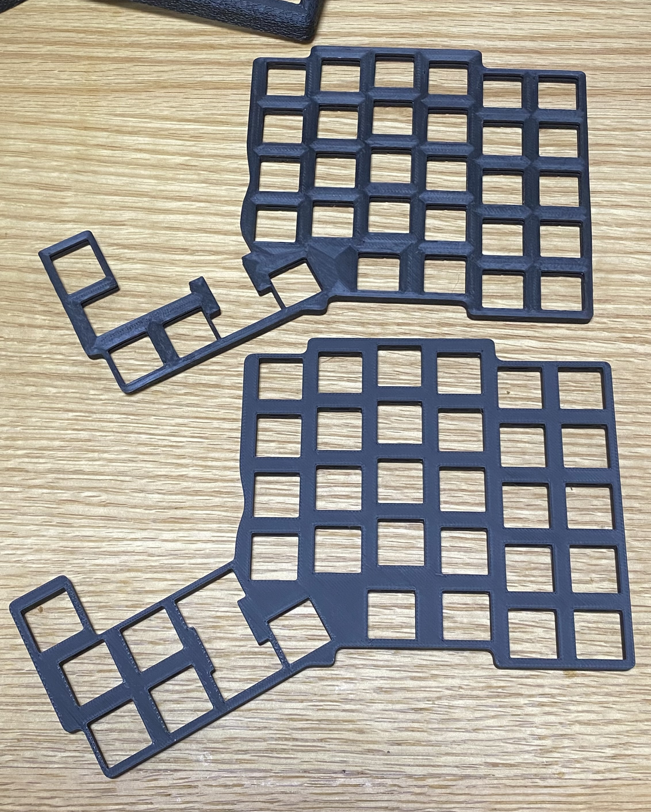
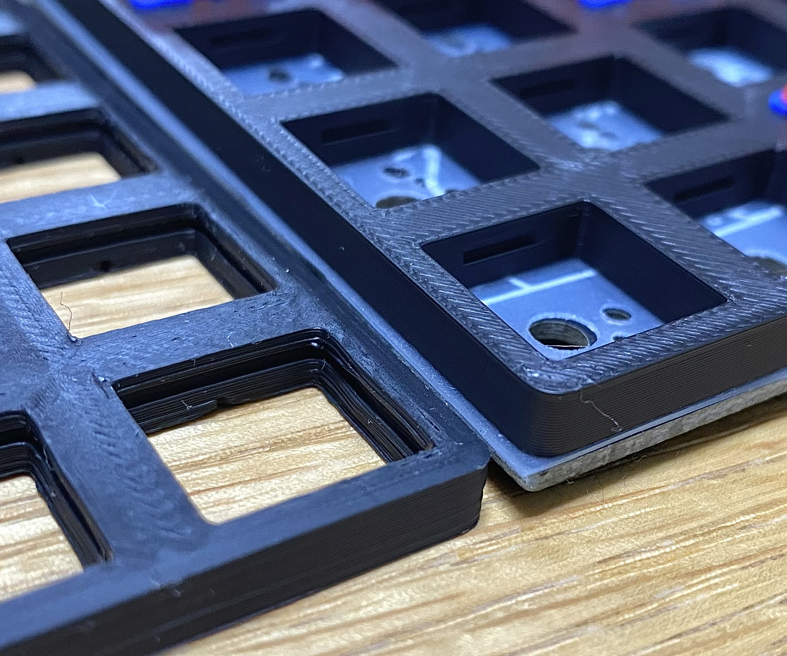

# 参考情報

## ※不備情報
### 2024/11/1：初期ロット(1つ)ご購入のお客様へ  
状態：解決済み  
不備：部品"エンコーダ部分カバー"が左右反転状態で印刷されていた。  
対応：正しいパーツを再度郵送。  

## キット内容の更新

### 25/3/4以降
* promicro Type-Cでも干渉しないようケースを改良しました。
### 25/2月以降
* 右手側のロータリーエンコーダのノブもキット内容に含めました。

## ミドルプレートの改良
過去Verは上。新規Verは下。  
より安定するように形状が変わっています。特に親指まわり  

## 接着剤
あくまで一つの参考ですが、レザーとプラスチックの接着剤などが良いかと思います。  
[コニシ ボンドGクリヤー](https://www.amazon.co.jp/TRUSCO-%E3%83%9C%E3%83%B3%E3%83%89G%E3%82%AF%E3%83%AA%E3%83%A4%E3%83%BC-%E3%83%96%E3%83%AA%E3%82%B9%E3%82%BF%E3%83%BC%E3%83%91%E3%83%83%E3%82%AF-14323-GC20B/dp/B015DZG348/ref=sr_1_6?sr=8-6)

私(ataruno)は以下を使っています。  
[セメダイン SUPER XG](https://www.amazon.co.jp/%E3%82%BB%E3%83%A1%E3%83%80%E3%82%A4%E3%83%B3-Cemedine-%E6%8E%A5%E7%9D%80%E5%89%A4%E3%82%B9%E3%83%BC%E3%83%91%E3%83%BCX%E3%82%B4%E3%83%BC%E3%83%AB%E3%83%89-%E9%80%9F%E7%A1%AC%E5%8C%96%E3%82%BF%E3%82%A4%E3%83%97-AX-023/dp/B0DBZRNV7B/ref=sr_1_4?__mk_ja_JP=%E3%82%AB%E3%82%BF%E3%82%AB%E3%83%8A&sr=8-4)

レザークラフトのゴムのりでもよいかと思います。  
